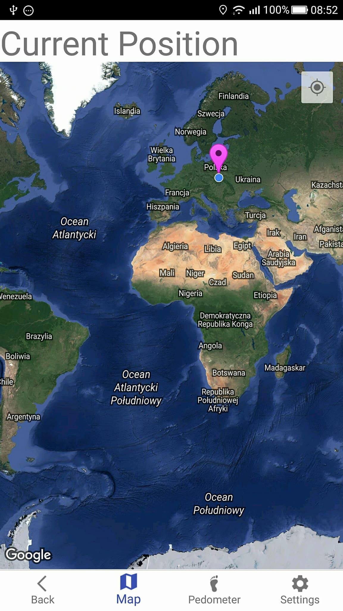

<table sytle="border: 0px;">
<tr>
<td></td>
</tr>
</table>

## Pedometr-Google-Maps-API-android

Application shows your possible position after doing steps. 

<table sytle="border: 0px;">
<tr>
<td>Find your current position</td>
<td>Do some steps</td>
<td>Shows possibly range of steps</td>
  
  </tr>
</table>

## API Reference

Google Maps API + android sensors + logic
<td></td>

